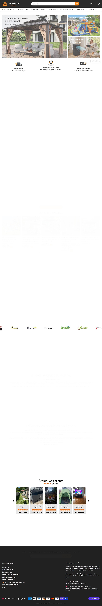
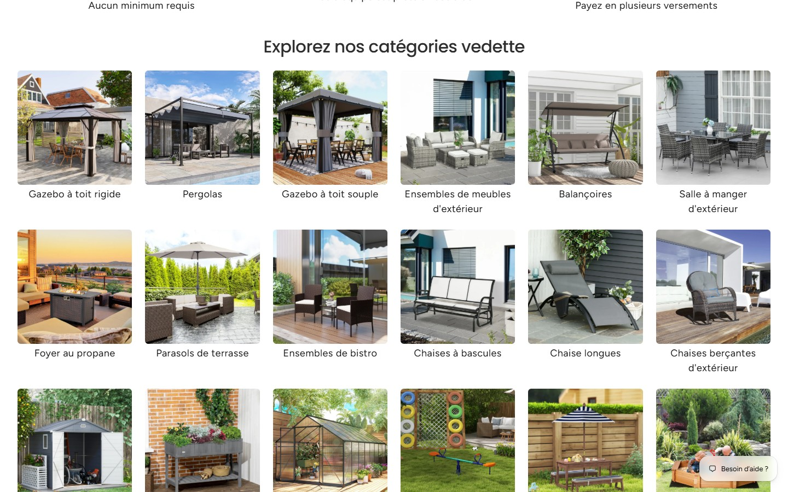
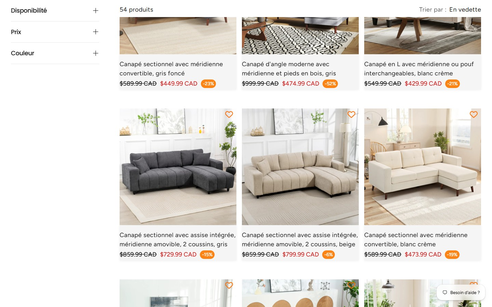
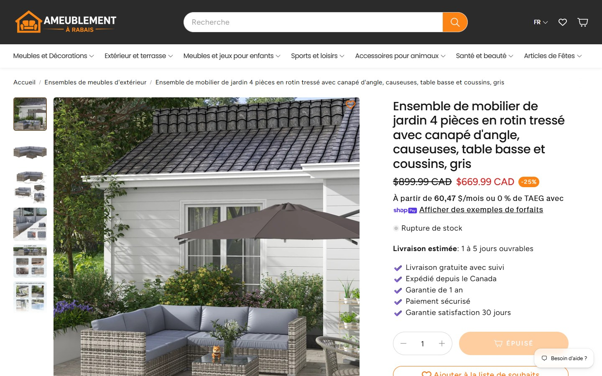
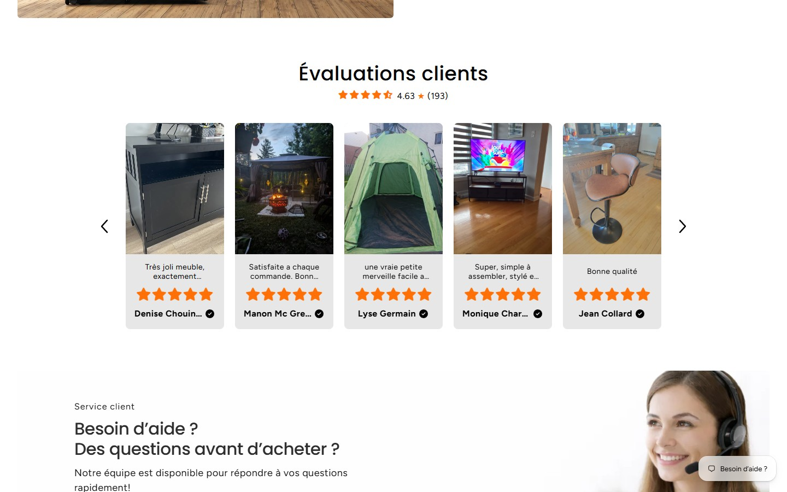
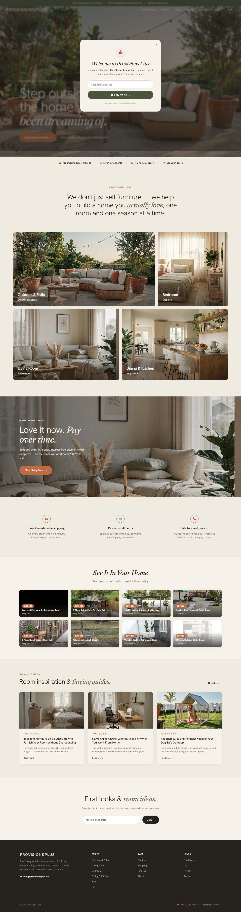
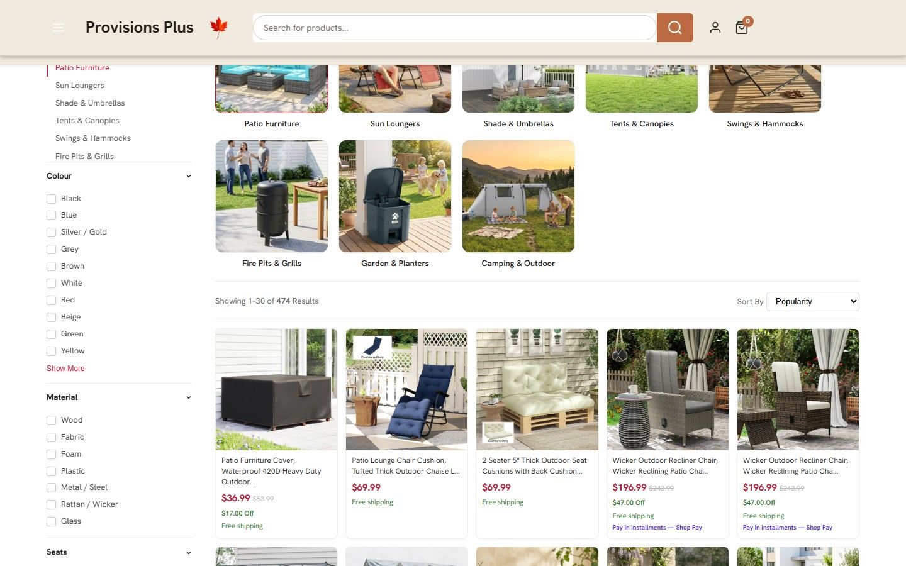
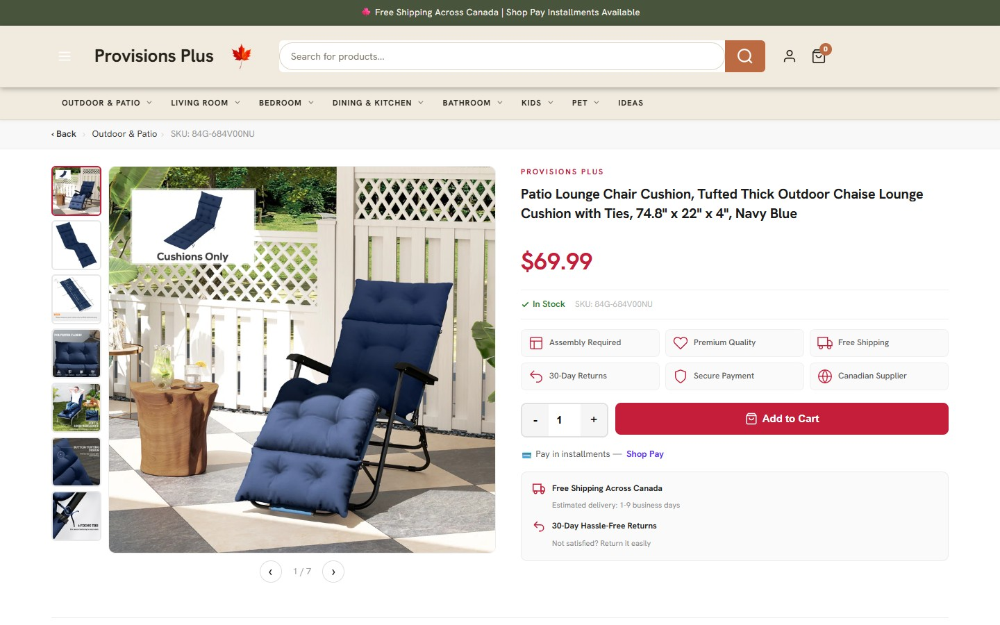

# Analyse concurrentielle — Ameublement à Rabais & Provisions Plus

_Scan Playwright du 2026-07-06. Deux concurrents directs qui vendent **le même catalogue Aosom/Outsunny qu'Ameublo Direct** (dropship). Objectif : relever ce qui convertit mieux chez eux et le traduire en actions concrètes pour Ameublo Direct (FR) et Furnish Direct (EN)._

Captures dans `docs/competitive-analysis-assets/`.

---

## TL;DR

| | **Ameublement à Rabais** (`ameublementarabais.ca`) | **Provisions Plus** (`provisionsplus.ca`) | **Ameublo Direct** (nous) |
|---|---|---|---|
| Langue / marché | FR (Québec) | EN (Canada) | FR primaire + EN (Furnish Direct) |
| Plateforme | Shopify | Shopify | Shopify |
| Catalogue | Aosom (identique au nôtre) | Aosom (identique) | Aosom |
| Positionnement | **Prix d'entrepôt / rabais** (-31 %, -25 %…) | **Marque lifestyle éditoriale** (« a home you actually love ») | Entre les deux |
| Avis clients | **Judge.me actif — 4,6★, carrousel photo en page d'accueil, badges vérifiés** | **Judge.me actif — coupons d'incitation configurés (5 % pour un avis)** | **Judge.me installé, 0 avis** ❌ |
| Estimé de livraison PDP | ✅ « Livraison estimée : 1 à 5 jours » | ✅ « Estimated delivery: 1-9 business days » | ⏳ ajouté en draft, pas publié |
| Financement Shop Pay | ✅ « À partir de 60,47 $/mois ou 0 % TAEG » + bandeau dédié | ✅ « Pay in installments » (barre + cartes + PDP + bandeau) | ❌ non mis en avant |
| Bloc confiance buy-box | ✅ 5 puces cochées | ✅ grille 6 icônes | ❌ minimal |
| Facettes de filtres | Disponibilité / Prix / Couleur | Catégorie / Couleur / **Matériau** / Sièges | limité |
| Navigation | Méga-menu par catégorie | **Par pièce** + hub éditorial « Ideas » | méga-menu |

**Les deux concurrents ont des avis clients live et un estimé de livraison ; nous avons zéro avis et l'estimé encore en draft. C'est le retard le plus visible et le plus coûteux en conversion.**

---

## 1. Ameublement à Rabais — le modèle « prix d'entrepôt » (FR)

### Navigation & catégories
- Méga-menu à 7 entrées : **Meubles et Décorations, Extérieur et terrasse, Meubles et jeux pour enfants, Sports et loisirs, Accessoires pour animaux, Santé et beauté, Articles de Fêtes** — exactement le découpage du catalogue Aosom.
- Sous-catégories très profondes (ex. Meubles et Décorations → Canapés, Sectionnels, **Fauteuils Masseurs**, Fauteuils releveurs électriques, Salon, Cuisine et salle à manger, Chambres, Mobilier de bureau…).
- Recherche mise en avant (grande barre centrale dans le header) + sélecteur FR + wishlist (cœur) + panier.

### Layout homepage
- **Hero 3 tuiles** : grande tuile gauche « Extérieur et terrasse à prix d'entrepôt — Jusqu'à 70 % de rabais », deux tuiles droite (« Faites le bonheur des enfants », « Restez au frais tout l'été »). Thème saisonnier (été/extérieur).
- **Barre de confiance 3 icônes** : _Livraison gratuite — Aucun minimum requis_ · _Par téléphone, chat ou courriel — Notre équipe est prête à vous aider_ · _Financement disponible — Payez en plusieurs versements_.
- **« Explorez nos catégories vedette »** — grille 6 colonnes de **photos lifestyle propres** (gazebos mis en scène, foyers au coucher du soleil), libellé sous chaque tuile. Aucun fond blanc.

- Carrousels de produits, **bandeau de logos fournisseurs** (Outsunny, PawHut, Soozier…) — ⚠️ ils affichent les marques fournisseurs (à NE PAS copier, voir §4).
- **Carrousel d'avis clients photo** (voir Confiance).
- Bloc « Service client — Besoin d'aide ? Des questions avant d'acheter ? » avec **photo d'un agent souriant avec casque**.

### Présentation des produits

- Grille collection 3 colonnes + **facettes latérales** : Disponibilité (En stock 39 / En rupture 15), Prix (curseur 0–1430 CAD), Couleur. Ils **montrent les produits épuisés** et laissent filtrer.
- Compteur « 54 produits » + tri « En vedette ».
- **Cartes produit** : photo lifestyle, titre FR descriptif (« Canapé sectionnel avec méridienne convertible, gris foncé »), prix barré + **prix rouge + pastille orange -23 %**, cœur wishlist. Chaque carte a un rabais → merchandising « toujours en solde ».

### PDP

- Fil d'Ariane, galerie miniatures verticale + grande **photo lifestyle en position 1**.
- Prix : 899,99 $ barré + 669,99 $ + pastille **-25 %**.
- **Financement** : « À partir de 60,47 $/mois ou 0 % de TAEG avec Shop Pay ».
- **« Livraison estimée : 1 à 5 jours ouvrables »** dans la buy-box.
- **Pile de confiance (5 puces cochées)** : Livraison gratuite avec suivi · Expédié depuis le Canada · Garantie de 1 an · Paiement sécurisé · Garantie satisfaction 30 jours.
- Produit épuisé → bouton « ÉPUISÉ » + **« S'abonner »** (avis de retour en stock) + « Ajouter à la liste de souhaits ». Widget de chat.

### Éléments de confiance

- **« Évaluations clients » — 4,63★ (193+)** : carrousel de **vraies photos clients** du produit chez eux, 5 étoiles, **badge vérifié (✓)** à côté du nom, extrait d'avis. C'est du Judge.me exploité à fond.
- Garanties répétées (30 jours satisfaction, 1 an), livraison gratuite, « entreprise fièrement canadienne ».

### Footer
- Colonnes Services clients / politiques / FAQ, blurb « entreprise fièrement canadienne », **téléphone + courriel + adresse (Saint-Jean-sur-Richelieu) + heures**, « Aucun magasin physique », icônes de paiement, réseaux sociaux, sélecteur langue/devise, capture courriel.

---

## 2. Provisions Plus — le modèle « marque lifestyle » (EN)

### Navigation & catégories
- **Navigation par PIÈCE** : Outdoor & Patio, Living Room, Bedroom, Dining & Kitchen, Bathroom, Kids, Pet — plus un onglet **« Ideas »** (Shop by Room + guides d'achat).
- Barre d'annonce : « 🍁 Free Shipping Across Canada | Shop Pay Installments Available » + rangée d'USP (« Free shipping • Pay in installments • 30-day easy returns »).

### Layout homepage
- **Hero pleine largeur** : photo lifestyle de patio au crépuscule (guirlandes lumineuses), titre serif « Step outside into the home you've been dreaming of. » + CTA. Aspirationnel, magazine.
- **Popup courriel de bienvenue** : « Welcome to Provisions Plus — get **5 % off your first order** — plus seasonal room inspiration… no spam ».
- **Barre de confiance 4 items** : Free shipping · Pay in installments · **Real human support** · Canadian-based.
- **Énoncé de marque** serif/italique : « We don't just sell furniture — we help you build a home you actually love, one room and one season at a time. »
- **Tuiles de catégories par pièce (grille 2×2)** grandes photos lifestyle : Outdoor & Patio, Bedroom, Living Room, Dining & Kitchen.
- **Bandeau financement** pleine largeur : « Love it now. Pay over time. Split any order into easy, interest-free payments with Shop Pay ».
- **Rangée 3 USP** : Free Canada-wide shipping · Pay in installments · **Talk to a real person**.
- **« See It In Your Home »** — galerie de **vidéos produit** (« real products, real quality — watch before you buy ») : Louvered Pergola, 7-Piece Rattan Set, Gazebo with Curtains, Hammock Swing Chair…
- **« Room inspiration & buying guides »** — cartes de **blog éditorial** datées (« Bedroom Furniture on a Budget », « Home Office Chairs: What to Look For », « Pet Enclosures and Kennels »).
- Bandeau newsletter « First looks & room ideas. »

### Présentation des produits

- **Tuiles de sous-catégories visuelles en haut** de la collection (Patio Furniture, Sun Loungers, Shade & Umbrellas…).
- Facettes latérales riches : **Catégories · Couleur (12+) · Matériau (Bois, Tissu, Mousse, Plastique, Métal, Rotin, Verre) · Sièges**.
- « Showing 1–30 of 474 Results » (paginé 30/page) + tri **Popularity**.
- **Cartes** : photo lifestyle, prix rouge + barré + **« $17.00 Off » (vert)** + **« Free shipping » (vert)** + **« Pay in installments — Shop Pay » (mauve)**. Micro-copie de réassurance sur chaque carte.

### PDP

- Eyebrow marque « PROVISIONS PLUS », titre, prix rouge, « ✓ In Stock ».
- **Grille de 6 icônes-bénéfices** : Assembly Required · Premium Quality · Free Shipping · 30-Day Returns · Secure Payment · **Canadian Supplier**.
- « Pay in installments — Shop Pay ».
- **Encadré mis en évidence** : « Free Shipping Across Canada — **Estimated delivery: 1-9 business days** » + « 30-Day Hassle-Free Returns ».
- **Description structurée en accordéon** : _Product Overview / Features / Shipping & Returns_ ; section Features en **icônes-bénéfices** (Premium Materials, Designed for Comfort, **Easy Assembly — most items in under 30 minutes**, Ships Fast & Free) ; **tableau de spécifications** (dimensions, matériau, type…).

### Éléments de confiance
- **Judge.me** (comme nous) avec **coupons d'incitation activés** : _« Write a review and get a coupon for X % off your next purchase »_, avec paliers photo/vidéo. C'est exactement le mécanisme de collecte d'avis qu'on n'a pas allumé.
- 4 items de confiance (dont **Real human support**), 30 jours retours, Canadian-based, popup de preuve sociale Judge.me configuré.

### Footer
- Sombre, colonnes Rooms / Care / House, courriel, « 🍁 Proudly Canadian · Free shipping nationwide ».

---

## 3. Comparaison directe

| Dimension | Ameublement à Rabais | Provisions Plus | Notre écart |
|---|---|---|---|
| **Avis** | 4,6★, carrousel photo home, badges vérifiés | Judge.me + coupons d'incitation | **0 avis — pire des trois** |
| **Estimé livraison PDP** | 1–5 j, dans la buy-box | 1–9 j, encadré dédié | draft non publié |
| **Financement** | « X $/mois ou 0 % TAEG » + bandeau | Barre + cartes + PDP + bandeau | absent |
| **Buy-box confiance** | 5 puces cochées | grille 6 icônes | quasi rien |
| **Barre USP** | 3 items | 4 items (+ « human support ») | absent |
| **Grille catégories home** | 6 col lifestyle | 2×2 pièces lifestyle | à construire |
| **Facettes** | Dispo/Prix/Couleur | +Matériau +Sièges | limité |
| **Nav par pièce** | non (par catégorie) | **oui** + « Ideas » | non |
| **Contenu éditorial/SEO** | non | **blog guides d'achat** | non |
| **Vidéos produit on-site** | non | **galerie « watch before you buy »** | ✅ on a déjà « Voyez-le chez vous » |
| **Popup courriel** | non visible | **5 % de bienvenue** | on a BIENVENUE10 mais pas de popup |
| **Wishlist** | oui | non | non |
| **Positionnement** | rabais agressif | marque aspirationnelle | à trancher par locale |

**Insight clé :** les deux vendent nos produits exacts. ARA gagne par le **prix + la preuve sociale** ; PP gagne par la **marque + l'éditorial + la réassurance**. Ameublo Direct (FR) devrait emprunter le levier prix/preuve d'ARA ; **Furnish Direct (EN) devrait copier le playbook lifestyle/éditorial de PP** (c'est presque exactement son positionnement cible).

---

## 4. Ce qu'on devrait adopter chez Ameublo Direct

_Idées concrètes seulement, priorisées. « Effort » = temps dev/config approximatif._

### P0 — Combler le retard qui coûte des ventes maintenant

1. **Allumer la collecte d'avis Judge.me avec coupon d'incitation — copier la config de Provisions Plus.** PP offre « écris un avis → coupon 5 % » avec paliers photo/vidéo. On a Judge.me installé et 0 avis. Activer : demandes d'avis natives post-livraison (trigger _fulfillment_ ~10 j) + coupon 5 % (paliers photo/vidéo). _(Effort : réglages dashboard Judge.me, ~1 h. Déjà documenté dans `REVIEWS-AUTOMATION.md` — les 2 concurrents prouvent le ROI.)_

2. **Carrousel d'avis photo en page d'accueil (style ARA), dès qu'il y a des avis.** Section « Évaluations clients » : note agrégée + carrousel de photos clients + **badge vérifié + prénom**. Section thème Shopify branchée sur le widget Judge.me « featured carousel ». _(Effort : 1 section de thème.)_

3. **Publier l'estimé de livraison PDP (déjà en draft) dans la buy-box, près du CTA.** Les deux l'affichent (« 1 à 5 » / « 1-9 jours ouvrables »). Format ARA : ligne « **Livraison estimée : X à Y jours ouvrables** » juste sous le prix. _(Effort : finir + publier le draft existant.)_

4. **Activer et mettre en avant Shop Pay Installments.** Les deux le poussent partout : PDP (« À partir de X $/mois ou 0 % TAEG »), cartes de collection (« Pay in installments — Shop Pay »), et un bandeau home dédié. → Activer Shop Pay Installments + afficher « À partir de X $/mois » sur la PDP. _(Effort : activation Shop Pay + snippet PDP.)_

### P1 — Réassurance & conversion (fort ROI, effort modéré)

5. **Pile de confiance dans la buy-box PDP.** Copier les 5 puces d'ARA / la grille 6 icônes de PP : _Livraison gratuite avec suivi · Expédié depuis le Canada · Garantie 1 an · Paiement sécurisé · Satisfaction 30 jours_. Placée sous le bouton d'achat. _(Effort : 1 bloc PDP.)_

6. **Barre d'USP globale (header ou sous-hero).** 3–4 items : _Livraison gratuite (sans minimum) · Paiement en versements · **Parlez à une vraie personne** · Entreprise canadienne_. PP ajoute « Real human support » — différenciateur humain fort. _(Effort : 1 barre + traduction FR/EN.)_

7. **Grille de catégories lifestyle en page d'accueil.** ARA « catégories vedette » (6 col) / PP tuiles par pièce (2×2), **photos lifestyle uniquement**. On vient de livrer les photos lifestyle pos-1 — on a le matériel. Ajouter une grille « Magasiner par pièce / par catégorie » avec ces photos. _(Effort : 1 section + collections.)_

8. **Facettes de filtres enrichies sur les collections.** Ajouter **Matériau** (Bois/Tissu/Métal/Rotin/Verre — PP) + Couleur + Prix + Disponibilité (ARA). Gros gain sur des collections de 400+ produits. _(Effort : config filtres Shopify / métachamps.)_

8b. **Micro-copie de réassurance sur les cartes produit** (style PP) : « Livraison gratuite » + « Paiement en versements » sous le prix de chaque carte. _(Effort : snippet carte.)_

### P2 — Marque & acquisition (surtout Furnish Direct / EN)

9. **Copier le playbook éditorial de PP pour Furnish Direct :** navigation **par pièce** + hub **« Ideas / Guides d'achat »** (blog SEO : « Bedroom Furniture on a Budget », « Home Office Chairs… »). C'est exactement le positionnement cible de Furnish Direct. _(Effort : blog + réorganisation nav — plus gros.)_

10. **Réutiliser nos vidéos demand-gen en galerie on-site « Voyez-le chez vous ».** PP a « See It In Your Home — watch before you buy ». On produit déjà des vidéos produit pour Meta/YT + on a déjà un carrousel « Voyez-le chez vous » en home → l'étendre en galerie par produit et l'embarquer sur la PDP. _(Effort : réutilisation d'actifs existants.)_

11. **Popup courriel de bienvenue avec incitation** (PP : 5 %). On a déjà le code **BIENVENUE10** + le flow Klaviyo, mais pas de popup de capture on-site → ajouter un popup « 10 % sur ta première commande » qui distribue BIENVENUE10. _(Effort : app popup / Klaviyo form.)_

12. **Description PDP structurée en accordéon + icônes-bénéfices + tableau de specs** (PP) : _Aperçu / Caractéristiques / Livraison & retours_, avec icônes (« Montage en moins de 30 min », « Expédié rapide et gratuit ») et un tableau dimensions/matériau. Nos descriptions Claude sont déjà riches — les structurer en accordéon + specs. _(Effort : template PDP + parsing des specs Aosom.)_

13. **Pastille de rabais % sur les cartes (style ARA -X %)** quand le rabais ≥ 10 % (on a déjà la règle compare-at ≥10 %). Le rabais chiffré est un levier prouvé sur le marché FR québécois. _(Effort : snippet carte.)_

14. **Bloc « Service client / Parlez à une vraie personne » + widget de chat.** ARA (photo d'agent) et PP (« Talk to a real person ») humanisent. Ajouter un bloc + chat. _(Effort : app chat + 1 bloc.)_

### ⚠️ À NE PAS copier (anti-patterns observés)
- **ARA affiche les logos fournisseurs** (Outsunny, PawHut, Soozier…). Interdit chez nous — garder la règle « aucun nom fournisseur en façade ».
- **PP laisse le SKU Aosom brut visible** (« Item Label : 84G-684V00NU », SKU dans le fil d'Ariane). Continuer à masquer/nettoyer les SKU.
- **PP a un bug d'affichage** « You save: $-69.99 » (économie négative quand pas de compare-at). Vérifier notre calcul compare-at.

---

## Méthode
Scan Playwright (Chromium, 1440×900) le 2026-07-06 : accueil, page collection et PDP de chaque site, extraction DOM (nav, prix, badges, facettes, blocs de confiance, footer) + captures. Prix et notes relevés en direct ; peuvent varier.
