# Reviews & funnel UX — Ameublement à Rabais vs Provisions Plus

_Scan Playwright détaillé du 2026-07-06. Parcours client complet simulé jusqu'au checkout (sans achat) + forensique des avis clients. Captures dans `docs/competitive-analysis-assets/` (préfixe `ux-`)._

Complète `competitive-analysis-2026-07.md` (vue d'ensemble). Ici : **combien d'avis, comment collectés**, et **chaque étape du tunnel**.

---

## Partie 1 — REVIEWS : forensique

Les deux tournent sur **Judge.me** (widget v3.0) — la **même app que nous**. Mais deux situations opposées.

| | Ameublement à Rabais | Provisions Plus | Ameublo Direct |
|---|---|---|---|
| Avis (agrégat boutique) | **193 avis · 4,63★ · « Vérifié »** | **~0 avis** (`data-number-of-reviews="0"`) | **0** |
| Affichage home | ✅ Carrousel de **photos clients** + note + prénoms + badge vérifié | ❌ aucun (home 100 % éditoriale) | ❌ |
| Widget PDP | Présent (souvent « Aucun avis » au niveau produit — les 193 sont boutique-wide) | Présent mais vide : « Be the first to write a review / No items found » | vide |
| `enable_coupons` | **false** | **true** (5 %, `any_review`) | — |
| `autopublish` | true | true | — |
| `review_verification_email_status` | **always** (avis d'acheteurs vérifiés) | always | — |
| Mécanique de collecte déduite | **Demandes d'avis Judge.me automatiques post-achat, vérifiées, sans coupon** | **Coupon 5 % pour un avis** configuré — mais **aucun volume** | rien d'activé |

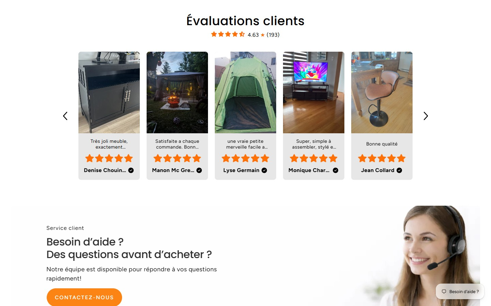
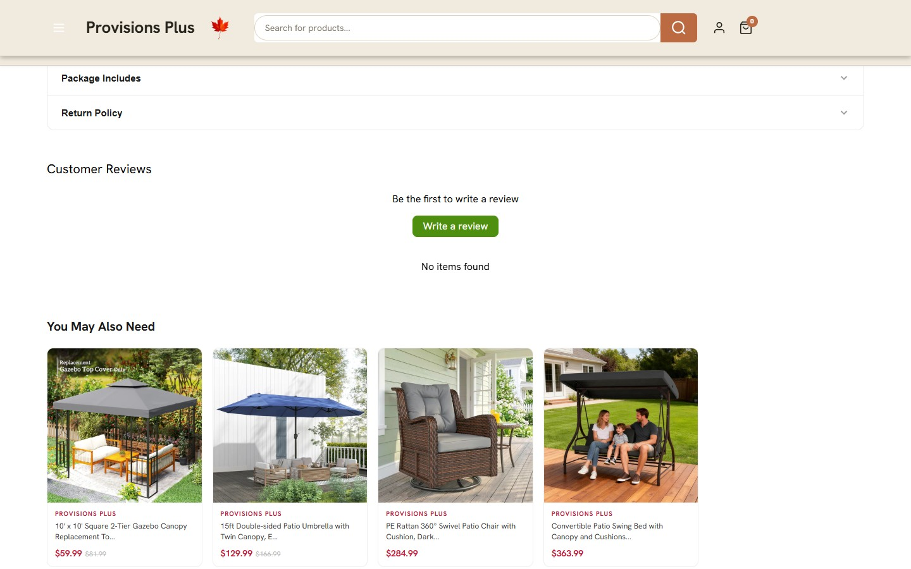

### Lecture
- **ARA a gagné par le volume + l'affichage**, pas par un coupon : 193 avis **vérifiés** collectés via les **demandes d'avis automatiques standard de Judge.me** (`verification_email: always`, `autopublish: true`, `enable_coupons: false`), puis remontés en **carrousel photo en page d'accueil** avec badges vérifiés. C'est de la preuve sociale de premier plan.
- **PP a le bon outillage, zéro contenu** : le coupon d'incitation 5 % est activé (`enable_coupons: true`, `any_review`) mais la boutique n'a **pas encore d'avis** — widget vide partout, aucun carrousel home. C'est une boutique **récente** qui a branché le mécanisme sans amorcer.
- **Depuis quand actifs :** non datable précisément depuis le storefront (les widgets ARA n'exposent pas les timestamps d'avis ; PP n'a pas d'avis à dater). Le volume ARA (193 vérifiés) implique un programme installé depuis des mois ; PP est manifestement en phase de lancement.

### Conséquence directe pour nous
On est aujourd'hui comme **PP en pire** : Judge.me installé, 0 avis, **et** pas de coupon ni de demande automatique activée. Le combo gagnant = celui d'ARA **plus** l'amorçage :
1. **Activer les demandes d'avis Judge.me post-achat vérifiées** (comme ARA — c'est la source des 193).
2. **Ajouter le coupon d'incitation** (comme PP — 5 % pour un avis, paliers photo/vidéo) pour accélérer.
3. **Amorcer** par import CSV éthique (sinon on reste au widget vide de PP pendant des mois).
4. **Afficher** en carrousel photo sur la home + badges PDP (le levier d'ARA).

---

## Partie 2 — TUNNEL : étape par étape

### 🟠 Ameublement à Rabais (FR — « prix d'entrepôt »)

**1. Homepage** — 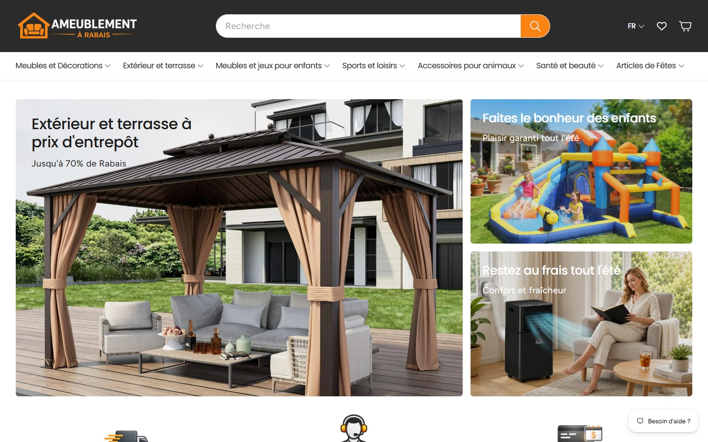
Hero 3 tuiles saisonnier (« Jusqu'à 70 % de rabais »), barre de confiance (Livraison gratuite / chat / Financement), recherche centrale proéminente. **Convertit :** promesse prix immédiate + réassurance au-dessus de la ligne de flottaison.

**2. Catégorie** — 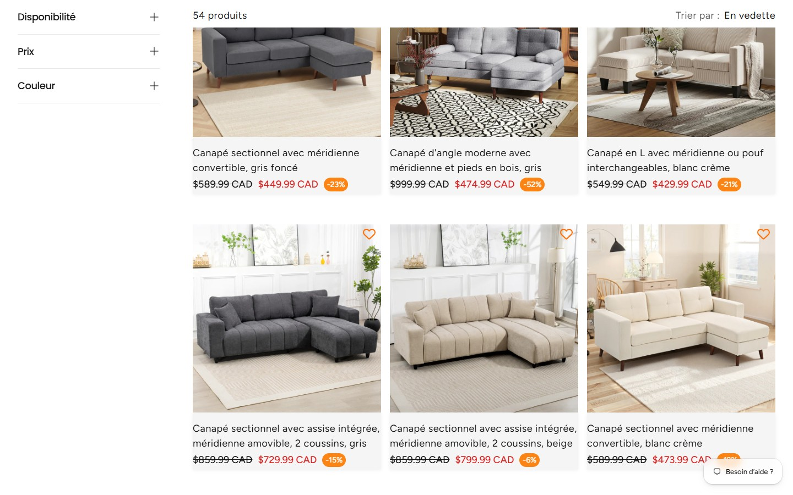
Grille 3 col, **facettes latérales** (Disponibilité / Prix / Couleur), tri « En vedette ». Cartes : photo lifestyle, prix barré + rouge + **pastille -23 %**, cœur wishlist. **Convertit :** rabais chiffré sur chaque carte. **Frictionne :** ils affichent les produits **Épuisés** dans la grille (dilue l'offre disponible).

**3. PDP** — 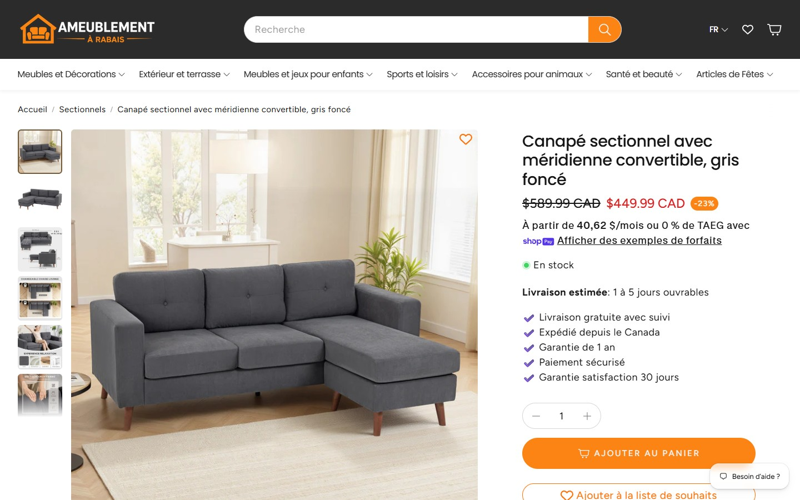
Galerie lifestyle pos-1, prix -23 %, **financement « 60,47 $/mois ou 0 % TAEG »**, **« Livraison estimée : 1 à 5 jours ouvrables »**, **5 puces de confiance** (livraison suivie, expédié du Canada, garantie 1 an, paiement sécurisé, satisfaction 30 j), wishlist, **« S'abonner » (retour en stock)**. Plus bas : **description SEO de 6 200 caractères**, blocs de réassurance multiples (« Nos mesures de sécurité », « Achetez en toute confiance », « Pourquoi plus de clients choisissent… »), et **cross-sell « Ceci pourrait vous intéresser »** (8 produits). Widget avis présent (0 sur ce produit). **Convertit fort :** empilement financement + délai + confiance + cross-sell. **Frictionne :** page très longue.

**4. Panier** — 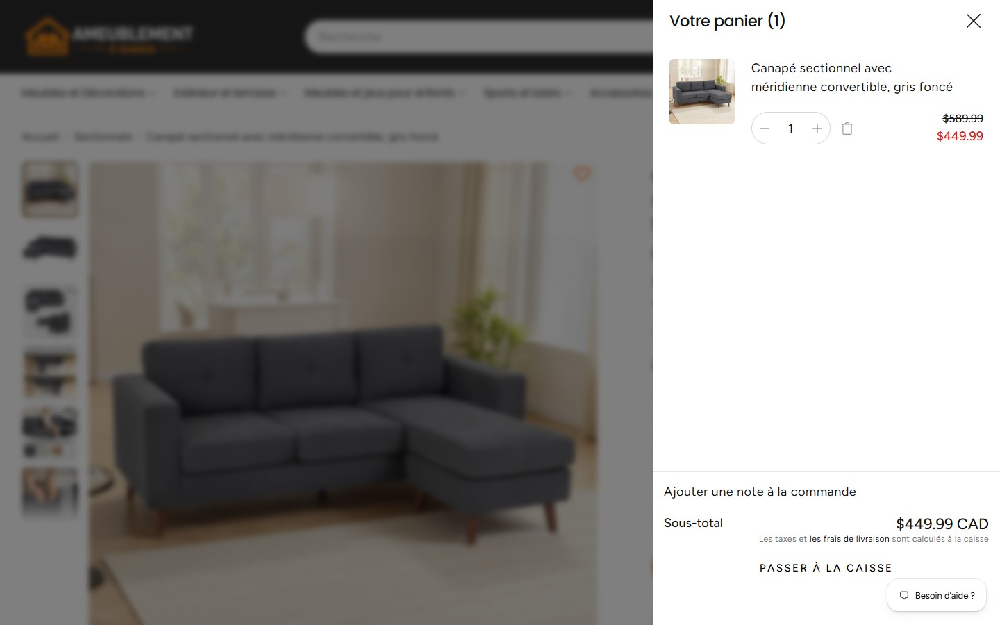
**Tiroir latéral** (reste sur la page) : ligne produit, **stepper quantité + poubelle**, note de commande, sous-total, « taxes et frais calculés à la caisse », « Passer à la caisse ». **Frictionne :** **aucun upsell ni barre de progression livraison gratuite** dans le panier (occasion ratée d'augmenter le panier moyen).

**5. Checkout** — 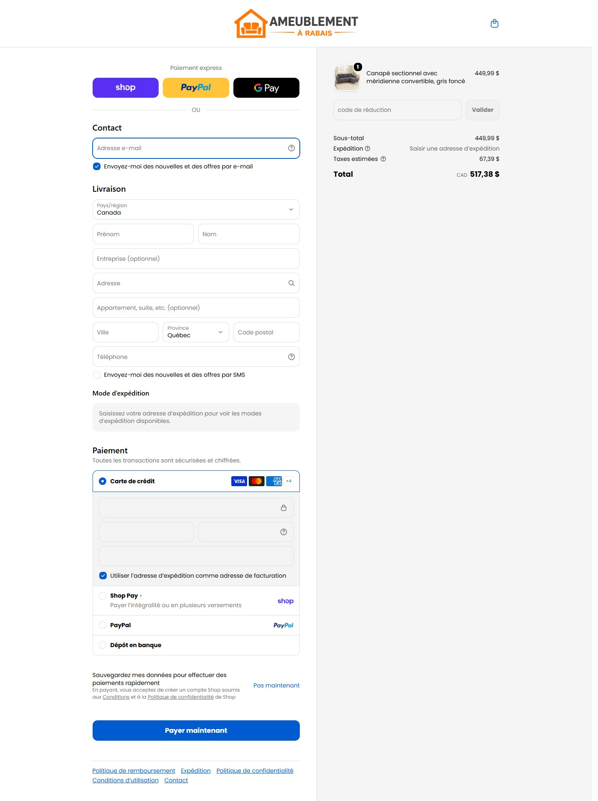
Shopify standard : express (Shop Pay / PayPal / G Pay), **opt-in courriel ET SMS pré-cochés**, autocomplétion d'adresse, **champ code promo**, paiements CB / **Shop Pay versements** / PayPal / **Dépôt en banque**, taxes estimées, total. **Convertit :** friction minimale, versements dispo. **À noter :** opt-ins marketing pré-cochés (agressif, limite consentement).

---

### 🟢 Provisions Plus (EN — « marque lifestyle »)

**1. Homepage** — 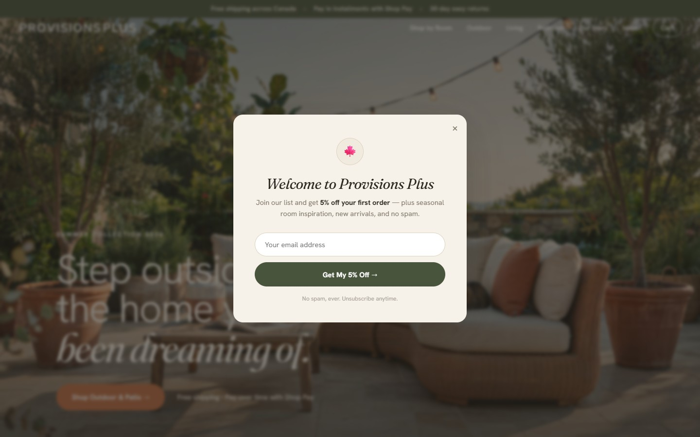
Hero éditorial pleine largeur (patio au crépuscule), titre serif aspirationnel, **popup courriel « 5 % off first order »**, barre de confiance 4 items dont **« Real human support »**. **Convertit :** capture courriel incitée + image de marque. **Frictionne :** peu de produit/prix au-dessus de la ligne de flottaison (home orientée marque, pas transaction).

**2. Catégorie** — 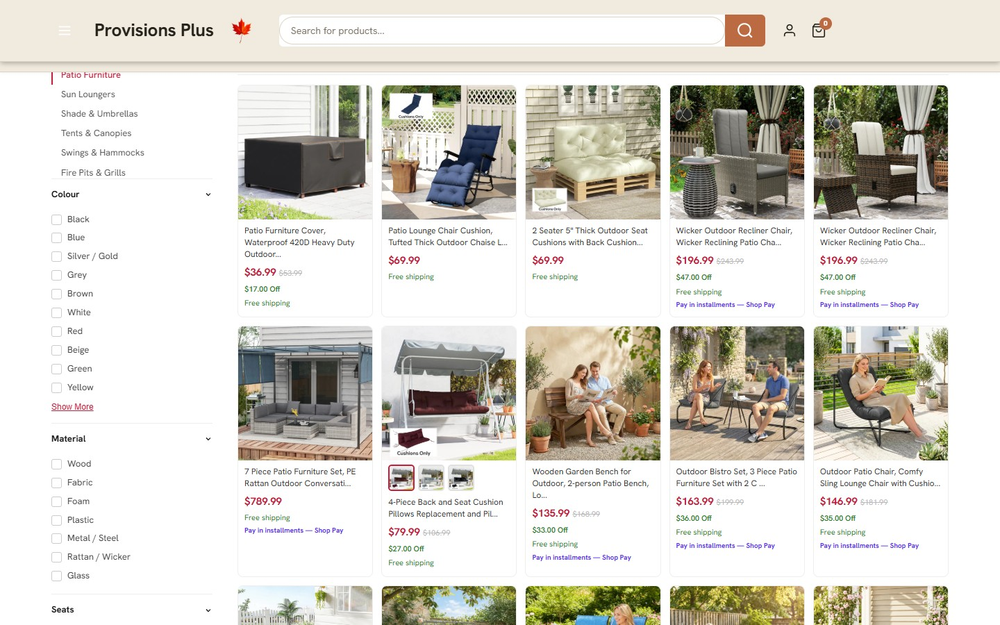
**Tuiles de sous-catégories visuelles en haut**, grille dense 5 col, facettes riches (**Matériau**, Sièges…), tri **Popularity**. Chaque carte : prix rouge + barré + **« $17.00 Off »** + **« Free shipping »** + **« Pay in installments — Shop Pay »**. **Convertit :** micro-réassurance (livraison + versements) sur **chaque** carte.

**3. PDP** — 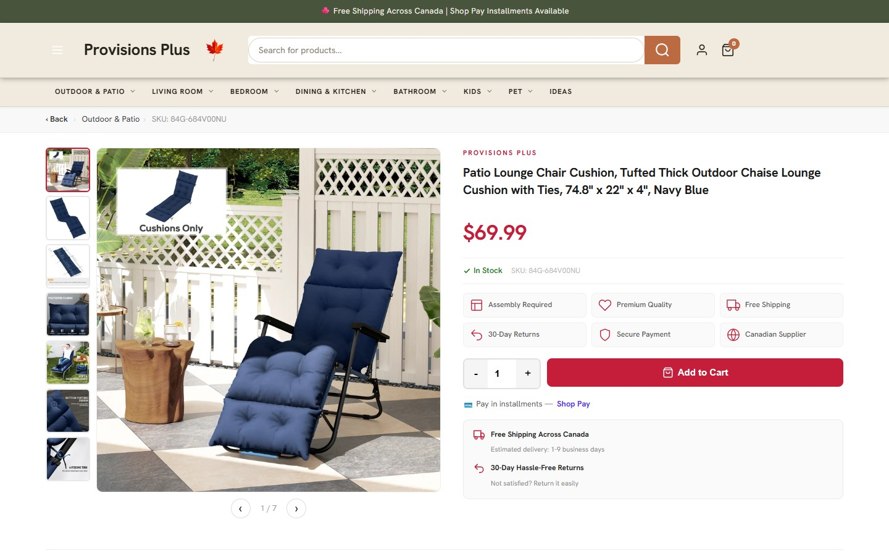
Galerie lifestyle, **grille 6 icônes-bénéfices** (Assembly / Premium Quality / Free Shipping / 30-Day Returns / Secure Payment / **Canadian Supplier**), **« Estimated delivery: 1-9 business days »**, versements Shop Pay. Description en **accordéon** (Overview / Features / Shipping & Returns) + **tableau de specs**, **cross-sell « You May Also Need »**. **Frictionne fort :** **widget avis vide** (« Be the first… ») → aucune preuve sociale.

**4. Panier** — 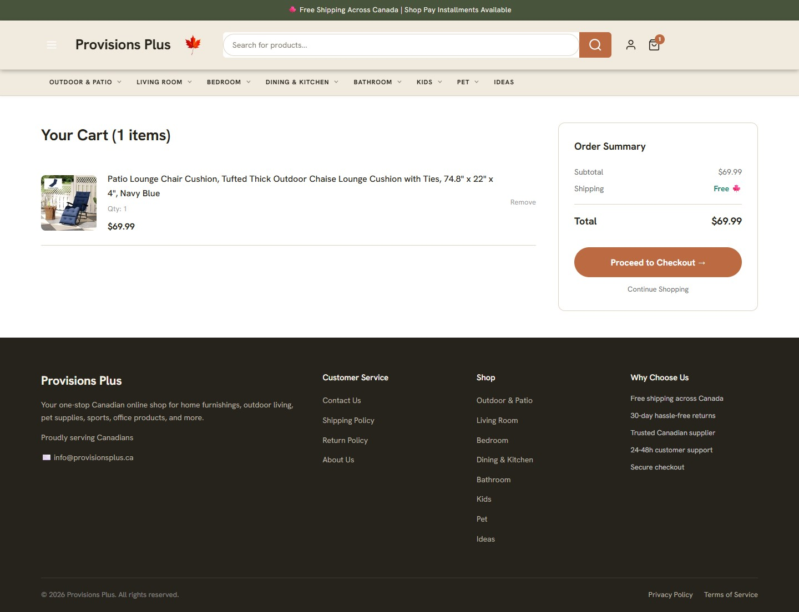
**Page pleine** (rechargement, quitte le contexte) : ligne produit avec **« Qty: 1 » statique (pas de stepper) + Remove**, Order Summary avec **« Shipping: Free »** affiché, « Proceed to Checkout ». Footer avec colonne **« Why Choose Us »** (24-48h support, secure checkout). **Frictionne :** panier en page pleine + pas de stepper quantité + pas d'upsell. **Convertit :** « Livraison gratuite » explicite dans le récap.

**5. Checkout** — 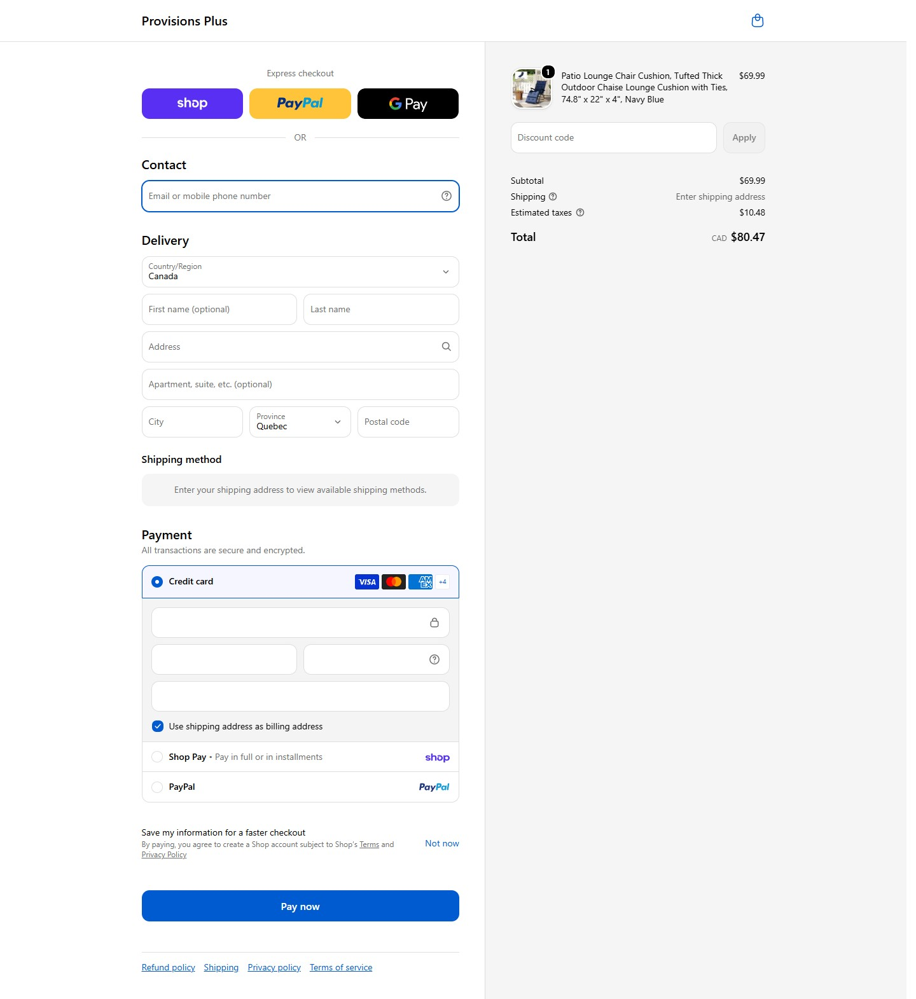
Shopify standard : express, **contact épuré (pas d'opt-in marketing pré-coché)**, code promo, CB / Shop Pay versements / PayPal, taxes estimées. **Convertit :** propre, consentement respecté (mieux qu'ARA sur ce point).

---

## Partie 3 — Comparatif tunnel & ce qu'on adopte

| Étape | ARA | PP | Meilleure pratique à prendre |
|---|---|---|---|
| **Home** | rabais + **carrousel avis (193)** | popup 5 % + éditorial + « human support » | **Carrousel avis** (ARA) + **popup courriel incité** (PP) |
| **Catégorie** | facettes basiques, **-% pill** | **+Matériau/Sièges**, microcopie par carte | **Facette Matériau** + **microcopie livraison/versements par carte** (PP) |
| **PDP** | financement 0 % TAEG, délai 1-5j, 5 puces, cross-sell, desc SEO | 6 icônes-bénéfices, délai 1-9j, accordéon + specs, cross-sell | **Estimé de livraison** + **financement affiché** + **pile de confiance** + **cross-sell** + **desc en accordéon + specs** |
| **Panier** | **tiroir** (reste sur page) + stepper | page pleine + « Free shipping » affiché | **Tiroir latéral avec stepper** (ARA) + **« Livraison gratuite » explicite** (PP) + **ajouter un upsell** (aucun des deux ne le fait — occasion) |
| **Checkout** | versements + dépôt banque, opt-ins pré-cochés | versements, contact épuré | **Shop Pay versements** partout ; **ne PAS pré-cocher** les opt-ins (PP > ARA) |

### Actions concrètes (par ordre d'impact)
1. **Avis (P0)** — activer demandes Judge.me post-achat vérifiées + coupon 5 % + **amorçage CSV** + **carrousel photo home** + badge PDP. C'est le seul écart où l'un des deux (ARA) écrase tout le monde ; on est le plus faible des trois.
2. **PDP (P0/P1)** — publier l'**estimé de livraison** (draft), afficher le **financement Shop Pay** (« à partir de X $/mois »), ajouter une **pile de confiance** (5 puces / 6 icônes) et un **cross-sell « Complétez votre pièce »**.
3. **Catégorie (P1)** — facette **Matériau** + **microcopie « Livraison gratuite / Paiement en versements »** sur chaque carte (PP), + pastille **-%** (ARA).
4. **Panier (P1)** — **tiroir latéral** (ARA, reste sur la page = moins d'abandon) avec **stepper quantité**, **« Livraison gratuite »** explicite, et **un module d'upsell** dans le panier (ni ARA ni PP ne le font → avantage possible pour nous).
5. **Home (P1)** — **popup courriel « 10 % » (BIENVENUE10)** (PP) + **carrousel d'avis** (ARA) dès qu'il y a du volume.
6. **Checkout (P2)** — garder les opt-ins marketing **non cochés par défaut** (PP fait mieux qu'ARA), activer **Shop Pay versements**.

### ⚠️ Frictions à éviter (observées)
- ARA : produits **Épuisés** mêlés dans les grilles ; **opt-ins pré-cochés** au checkout (limite du consentement).
- PP : **0 avis** (widget vide = anti-preuve sociale) ; **panier en page pleine sans stepper** ; home trop « marque » (peu de produit/prix au-dessus de la ligne de flottaison).

---

## Méthode
Playwright (Chromium 1440×900), 2026-07-06. Pour chaque site : home → catégorie → PDP (produit **en stock**) → ajout au panier → **page de checkout Shopify atteinte, sans finaliser**. Extraction DOM (config `jdgmSettings`, compteurs d'avis, facettes, prix, boutons) + captures par étape. Aucune commande passée.
